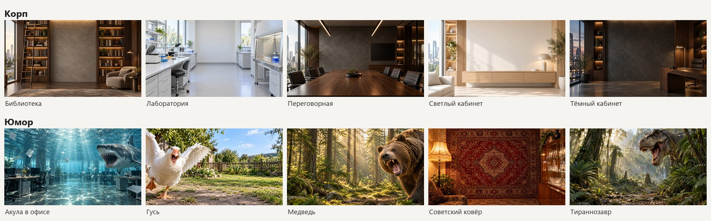

# Shirma

Виртуальный фон для звонков на Windows (и экспериментально на macOS): камера → вырезание человека → любой фон → камера «OBS Virtual Camera», которую видит любая программа для звонков (Zoom, Teams, Телемост, VK Teams, браузер).

Под капотом — [OBS Studio](https://obsproject.com) и плагин [obs-backgroundremoval](https://github.com/royshil/obs-backgroundremoval), но сам OBS вы не видите: Shirma запускает его в трее и даёт маленькое меню рядом с часами.



## Установка

PowerShell, права администратора не нужны:

```powershell
irm https://raw.githubusercontent.com/aeamosov/obs-shirma/main/install.ps1 | iex
```

Установщик:

1. ставит OBS Studio через `winget`, если его нет;
2. ставит плагин obs-backgroundremoval в `%ProgramData%\obs-studio\plugins`;
3. ставит Python 3.12 для текущего пользователя, если подходящего нет;
4. копирует Shirma в `%LOCALAPPDATA%\Shirma`;
5. находит камеру (если камер несколько — спросит, какую взять) и создаёт в OBS **отдельные** профиль и сцену `Shirma` — ваши профили и сцены не трогает;
6. создаёт ярлык Shirma на рабочем столе и в меню «Пуск».

Повторный запуск команды обновляет Shirma, и ранее выбранная камера сохраняется; то же делает пункт меню **Обновить Shirma…**.

Выбрать камеру без вопроса: `& ([scriptblock]::Create((irm https://raw.githubusercontent.com/aeamosov/obs-shirma/main/install.ps1))) -Camera Logitech`.

### macOS (экспериментально)

Терминал, права администратора не нужны:

```bash
bash -c "$(curl -fsSL https://raw.githubusercontent.com/aeamosov/obs-shirma/main/install-mac.sh)"
```

Ставит OBS (через Homebrew, если он есть, иначе образ с GitHub), плагин obs-backgroundremoval в домашнюю папку, окружение Python, профиль и сцену `Shirma` и приложение **Shirma** в `~/Applications`. При первом запуске macOS спросит две вещи — разрешите обе: доступ OBS к камере и системное расширение OBS Virtual Camera (после разрешения расширения выключите Shirma в её меню и запустите снова).

> Mac-версия собрана по документации OBS и плагина и **на живом Mac ещё не проверялась**. Если попробовали — напишите в [issues](https://github.com/aeamosov/obs-shirma/issues), что сработало, а что нет.

Отличия от Windows:

- плагин под macOS — другая его реализация (CoreML, одна модель), поэтому нет «Качества маски» и тонкой настройки; «Без фона» и «Размытие» есть;
- камера включена всё время, пока Shirma запущена (на Windows — только во время звонка или превью);
- в строке меню два значка — Shirma и OBS;
- нет окна свойств камеры и запоминания её настроек;
- удаление: `bash -c "$(curl -fsSL https://raw.githubusercontent.com/aeamosov/obs-shirma/main/uninstall-mac.sh)"`.

## Как пользоваться

1. Запустите **Shirma** ярлыком. OBS стартует невидимым, в трее появится один значок — Shirma: значок OBS она убирает, а при первом запуске сама выводит себя на панель, а не в «^».
2. В программе для звонков выберите камеру **«OBS Virtual Camera»**.
3. Меню значка (клик — превью):
   - **Показать превью** — окно с тем, что видят в звонке, 1:1 по разрешению кадра (если не влезает в экран — уменьшается) (на время превью включается камера);
   - **Фон** — выбрать фон;
   - **Фон ▸ Без фона — только камера** и **Фон ▸ Размытие** (лёгкое / среднее / сильное) — Shirma как утилита для камеры: без замены фона или с размытием собственного фона камеры;
   - **Добавить свой фон…** — любая картинка, подгоняется под кадр автоматически;
   - **Открыть папку с фонами**;
   - **Камера** — выбрать камеру из подключённых, переключается на лету;
   - **Настройки ▸ Отразить по горизонтали** — отдельно фон и камеру (программы звонка и так показывают вам ваше изображение зеркально, собеседники видят без отражения — отражённая камера перевернёт для них надписи);
   - **Настройки ▸ Качество маски** — высокое (по умолчанию), среднее или своё; **Настроить маску…** — окно с ползунками: чувствительность (меньше режет одежду), запас вокруг силуэта, плавность границы во времени, мягкость края. Изменения видны примерно через полсекунды;
   - **Настройки ▸ Камера: яркость, зум, фокус…** — штатное окно свойств драйвера камеры (набор настроек зависит от камеры); на время окна камера включается. Shirma запоминает эти значения для каждой камеры и возвращает их при каждом включении — часть камер сбрасывает яркость и зум, когда их открывают заново;
   - **Настройки ▸ Разрешение** — 720p (по умолчанию) или 1080p; при смене виртуальная камера на секунду перезапускается;
   - **Диагностика…** — реальное разрешение камеры и что запрошено, размер кадра, FPS рендера OBS, доля опоздавших кадров за 10 секунд; кнопка «Скопировать сводку» для разбора проблем;
   - **Обновить Shirma…** — сверяет установленную версию с GitHub и, если вы согласны, запускает тот же установщик в отдельном окне. Камера и все настройки сохраняются; Shirma выключится примерно на минуту, поэтому лучше не во время звонка;
   - **Автозапуск** — запускать вместе с Windows (по умолчанию выключено; пока Shirma запущена, камера включена);
   - **Выключить Shirma** — закрыть OBS и значок.

### Свои фоны

Фон — это любая картинка в `%LOCALAPPDATA%\Shirma\backgrounds` (jpg, png, webp, bmp). **Название в меню = имя файла**: положите `Пляж.jpg` — через пару секунд в меню появится «Пляж». Удалили или переименовали файл — меню обновится само. Размер и пропорции любые: при выборе картинка обрезается до 16:9.

**Папки = подменю.** Создайте в `backgrounds` любую папку — она станет подменю в «Фон», с тем же названием:

```
backgrounds\
├─ Корп\   → Фон ▸ Корп ▸ …
├─ Юмор\            → Фон ▸ Юмор ▸ …
├─ Свои\ → Фон ▸ Свои ▸ …  (сюда кладёт «Добавить свой фон…»)
├─ Праздники\       → Фон ▸ Праздники ▸ …  (картинки из вложенных папок тоже попадут сюда)
└─ Пляж.jpg         → Фон ▸ Пляж            (картинки в корне — прямо в меню)
```

Пустые папки в меню не показываются, галочка на папке подсказывает, где лежит текущий фон. «Добавить свой фон…» кладёт картинку в «Свои»; перетащите её в другую папку — меню обновится само.

Удобнее всего, когда главное на картинке — слева, справа или сверху: центр снизу закроете вы.

Повторная установка не трогает ваши картинки: добавляет новые фоны из набора, раскладывает старые по папкам, а ваши картинки из корня переносит в «Свои».

## Как это устроено

```
камера ─► OBS (сцена Shirma: фон + камера с фильтром «Удаление фона») ─► OBS Virtual Camera ─► звонок
                    ▲
        active.jpg ─┘◄── значок в трее (shirma.py) подменяет файл, OBS перечитывает его сам
```

- Вырезание — плагин obs-backgroundremoval, модель PP-HumanSeg: держит плечи даже на тёмной одежде и не задерживает видео. Плагин считает маску прямо в потоке видео, поэтому тяжёлые модели под нагрузкой от программы звонка тормозят кадры; RVM на тёмном пиджаке перед тёмным креслом теряла плечо целиком, а selfie_segmentation пропускала спинку кресла.

  | Качество | Что получаем |
  |---|---|
  | Высокое | устойчивая граница: сильнее сглаживание во времени и контура |
  | Среднее | граница быстрее догоняет движение, но подрагивает |

- **Камера работает только когда нужна.** Программа звонка, которая берёт кадры виртуальной камеры, держит открытым дескриптор общей памяти `OBSVirtualCamVideo`; Lua раз в полсекунды смотрит, сколько их (~10 мкс). Пока никто не читает и окно превью закрыто, камера спрятана в сцене и OBS её отпускает — лампочка не горит. Звонок или превью — камера включается за секунду; после — гаснет через 5 секунд.
- Lua-скрипт внутри OBS убирает значок OBS из трея (OBS прячет окно при старте, только если его значок включён, поэтому значок снимается уже после старта), открывает превью как окно-проектор OBS и поднимает значок Shirma снова, если тот закрылся — иначе невидимый OBS нечем было бы выключить.
- Камеру и качество переключает тот же скрипт: раз в 2 секунды читает `camera.json` и `quality.json` и меняет источник и фильтр без перезапуска OBS. Если выбранная камера не умеет 1280×720, через 4 секунды берётся её родное разрешение.
- Значок в трее поднимает сам OBS Lua-скриптом `shirma.lua` и закрывается вместе с OBS.
- Ярлык запускает `obs64.exe` напрямую — см. ниже, почему это важно.

## Корпоративные антивирусы

Некоторые EDR/антивирусы (например, Kaspersky Endpoint Security с контролем доступа к веб-камере) отдают **пустые кадры** камеры процессам, запущенным из скриптов, и их потомкам. Симптом: в звонке виден только фон, без вас. Поэтому:

- запускайте Shirma **только ярлыком** (или автозапуском), не из консоли и не из своих скриптов;
- установщик сам OBS не запускает;
- если не помогло — попросите ИБ разрешить доступ к веб-камере для `obs64.exe`.

## Удаление

```powershell
irm https://raw.githubusercontent.com/aeamosov/obs-shirma/main/uninstall.ps1 | iex
```

Удаляет ярлыки, автозапуск, `%LOCALAPPDATA%\Shirma`, профиль и сцену OBS `Shirma`. Ваши фоны сохраняются в «Изображения\Shirma backgrounds». OBS и плагин остаются; плагин удаляется ключом `-RemovePlugin`.

## Частые проблемы

| Симптом | Что сделать |
|---|---|
| В звонке только фон | Запустите Shirma ярлыком, а не из консоли (см. «Корпоративные антивирусы»). Проверьте, что камеру не занимает другая программа. |
| Нет камеры «OBS Virtual Camera» | Запустите Shirma до программы для звонков или перезапустите программу для звонков. |
| Не та камера | Меню значка → **Камера**. |
| Ярлык со старой иконкой | Кэш значков Windows, обновится сам. |
| Установка раньше падала на `ie4uinit.exe` | Обновите установщик командой выше. Это необязательная системная утилита обновления значков; её отсутствие больше не мешает установке и запуску Shirma. |

## Лицензии

- Код Shirma — [MIT](LICENSE).
- Фоны в `backgrounds/` сгенерированы нейросетью для этого проекта и распространяются на тех же условиях, что и код.
- OBS Studio (GPL-2.0) и obs-backgroundremoval (GPL-3.0) в репозиторий не входят: установщик скачивает их из официальных источников.

---

## English

**Shirma** (Russian for "folding screen") is a virtual background for video calls on Windows, built on OBS Studio and the obs-backgroundremoval plugin, with OBS hidden in the tray and a tiny tray menu to switch backgrounds. Install with `irm https://raw.githubusercontent.com/aeamosov/obs-shirma/main/install.ps1 | iex`, start "Shirma" from the desktop shortcut, pick the "OBS Virtual Camera" camera in your call app. Any image dropped into `%LOCALAPPDATA%\Shirma\backgrounds` becomes a background named after the file. Camera settings (brightness, zoom, focus) are remembered per camera and restored whenever the camera turns on; **Update Shirma…** in the tray menu checks GitHub and re-runs the installer, keeping your camera and settings. MIT license.

**macOS (experimental, not yet tested on a real Mac):** `bash -c "$(curl -fsSL https://raw.githubusercontent.com/aeamosov/obs-shirma/main/install-mac.sh)"`. Allow OBS camera access and the OBS Virtual Camera system extension on first start. The macOS plugin is a different (CoreML) implementation, so there is no mask quality tuning; the camera stays on while Shirma runs. Remove with `uninstall-mac.sh`. Reports via issues are welcome.
